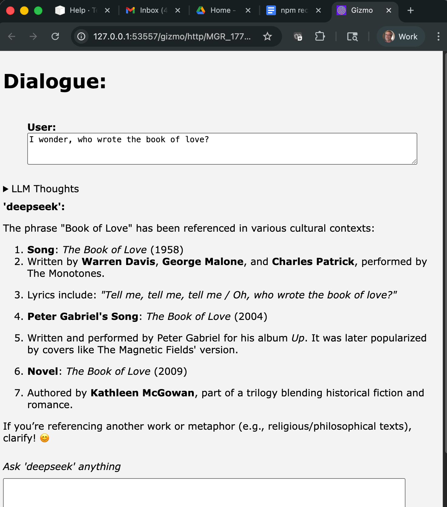

# gzchat
A command line graphical LLM chat interface that opens in the browser.



# Installation

To install the python module and the command line into your existing python 3 installation:

```
 pip install gzchat
```

# Running the command line

To choose canned models from the interface launch the the command line with no arguments:

```
 gzchat
```

To specify the model name and end point explicitly:

```bash
 gzchat --model deepseek-ai/DeepSeek-R6 --url http://workergpuamd4:8000/v1/chat/completions
```

The command line does not immediately open the user interface.  Instead it prints a URL
to connect to the user interface.  Click or paste the URL into a browser to open the interface.

```bash

(py313) HP07M20G6J:test awatters$ gzchat

Open gizmo using link (control-click / open link)

<a href="http://127.0.0.1:53598/gizmo/http/MGR_1776896745171_2/index.html" target="_blank">Click to open</a> <br> 
 GIZMO_LINK: http://127.0.0.1:53598/gizmo/http/MGR_1776896745171_2/index.html 
```

# Development install

To install the module in development mode, clone the git repository and then run:

```bash
pip install -e .
```